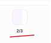
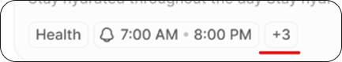
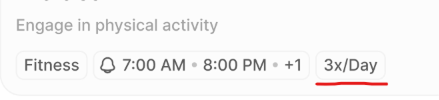
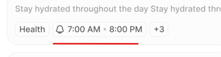

# Habits Board — MVP, Rules, Flow, and Figma (Pixel-Perfect Contract)

Status: Frontend API integration in progress (`src/features/habits/`); empty-board ghosts still local mock  
Primary route: `/user/habits`  
Frontend module: `src/pages/private/user/focus/Habits/` + `src/features/habits/`

Same contract style as Tasks (`focus/Tasks/tasks.md`) and Planner (`planng/DailyPlan/planner.md`).

**Source brief (authentic):** PIXEL-PERFECT FIX — Habits Board Flow — MVP + RULES + FLOW + FIGMA UI.  
**Do not invent. Do not remove Figma controls. Change only what the Fix requires.**

Requirement images (same 4 annotations from the brief):  
`docs/requirements-images/`

| Brief | File |
|-------|------|
| Image 1 | [`image-1-mvp-one-click-not-2-of-3.png`](./docs/requirements-images/image-1-mvp-one-click-not-2-of-3.png) |
| Image 2 | [`image-2-overflow-plus-n.png`](./docs/requirements-images/image-2-overflow-plus-n.png) |
| Image 3 | [`image-3-popup-3x-day.png`](./docs/requirements-images/image-3-popup-3x-day.png) |
| Image 4 | [`image-4-popup-multi-time.png`](./docs/requirements-images/image-4-popup-multi-time.png) |

---

## Fix ONLY

Habits Board Flow: Check the **MVP**, **RULES**, **FLOW**, and **FIGMA UI** pixel perfect.

## Do NOT touch

Figma UI design — if you need to update Figma, you can; do not invent controls that remove approved Figma affordances without product confirmation.

---

## MVP

> **Not in the MVP, just one time per day (1 click on habit box), see image 1.**

**Image 1 meaning:** The fractional day cell (`2/3` / `1/2` style) is **not** MVP. Product behavior is **one time per day** = **1 click** on the habit day box (empty ↔ checked).

---

## RULES

### Habit card — overflow tags note

When there isn't enough space to show all tags on the habit card, extra tags are hidden and replaced with a number, such as **+3**. On hover over this number, all hidden tags appear as a dropdown list or tooltip. Styles follow the same hover pattern used across the product. **See image 2.**

### Habits popup

- **Times Per Day:** Only one time per day is supported in MVP. No multiple times option needed.
- **Reminder Time:** one reminder per day, at a single time. Just one time picker, **12h** format.  
  **See image 3, 4.**

**Image 3 / 4 meaning for popup:** Do not add a “Times Per Day / 3x/Day” control or multiple reminder time pickers in Manual New Habit. One time, one picker, 12h.

### Filters annotation

| Filter | Options (exact) |
|--------|-----------------|
| Category | All Category / Career / Health / Finance / Fitness / Wellness / Productivity / Personal / Education |
| Schedule | All Schedule / Daily / Weekly / Monthly / Custom |
| Streak | All Streak / Active streak / No streak / Best streak |
| Days Left | All Days Left / 1-7 days / 8-30 days / 30+ days |

Keep **all 4** filters (including **All Streak**), even if some Figma frames draw only three.

---

## Figma nodes

File: [Elyxa.Ai — Phase 2](https://www.figma.com/design/VwgJovqBGtb90CEfNXkk2T/Elyxa.Ai--Phase-2---Copy-)

| Frame | Link |
|-------|------|
| Habits Board (1440) - 1 - Empty States | https://www.figma.com/design/VwgJovqBGtb90CEfNXkk2T/Elyxa.Ai--Phase-2---Copy-?node-id=1243-7175&m=dev |
| Habits Board (1440) - 1 - Empty States - Hover | https://www.figma.com/design/VwgJovqBGtb90CEfNXkk2T/Elyxa.Ai--Phase-2---Copy-?node-id=1243-7663&m=dev |
| Habits Board (1440) - 1 | https://www.figma.com/design/VwgJovqBGtb90CEfNXkk2T/Elyxa.Ai--Phase-2---Copy-?node-id=1234-11897&m=dev |
| Habits Board (1440) - 1.1 - Hover | https://www.figma.com/design/VwgJovqBGtb90CEfNXkk2T/Elyxa.Ai--Phase-2---Copy-?node-id=1237-12542&m=dev |
| Habits Board (1440) - 1.2 - Hover | https://www.figma.com/design/VwgJovqBGtb90CEfNXkk2T/Elyxa.Ai--Phase-2---Copy-?node-id=1237-13017&m=dev |
| Habits Board (1440) - 2 | https://www.figma.com/design/VwgJovqBGtb90CEfNXkk2T/Elyxa.Ai--Phase-2---Copy-?node-id=1237-13457&m=dev |
| Habits Board (1440) - 2.1 | https://www.figma.com/design/VwgJovqBGtb90CEfNXkk2T/Elyxa.Ai--Phase-2---Copy-?node-id=1237-13935&m=dev |
| Habits Board (1440) - 3 | https://www.figma.com/design/VwgJovqBGtb90CEfNXkk2T/Elyxa.Ai--Phase-2---Copy-?node-id=1239-5884&m=dev |

Node IDs: `1243:7175`, `1243:7663`, `1234:11897`, `1237:12542`, `1237:13017`, `1237:13457`, `1237:13935`, `1239:5884`.

---

## FLOW — how to verify in the app

Build must flow from **Figma + MVP + Rules**. Verify full flow before done.

| Step | URL / action | Matches |
|------|----------------|---------|
| Empty | `/user/habits?empty=1` | Figma Empty States |
| Empty hover | Same → hover ghost | Empty States — Hover (Accept Habit; tags hide) |
| Populated | `/user/habits` | Figma - 1 |
| Row hover | Populated → hover row → ⋯ | 1.1 / 1.2 |
| New Habit AI | **+ New Habit** → AI | Frame 2 |
| New Habit Manual | **+ New Habit** → Manual | Frame 2.1 — **one** Reminder Time, 12h |
| AI preview | Generate → preview row | Frame 3 |
| Image 1 MVP | Day box **1 click** (not multi `2/3` product) | MVP |
| Image 2 | Drink Water → hover **`+3`** | Overflow rule |
| Image 3–4 | Manual tab — no 3x / no multi time picker | Habits popup rule |
| Filters | Toolbar shows Category, Schedule, **Streak**, Days Left | Filters annotation |

---

## Agent rules (from brief)

- Build must flow yourself from Figma + MVP + Rules  
- Change only Fix ONLY  
- Do not invent  
- Do not remove any Figma control  
- Verify full flow before done  

---

## Implementation map

| File | Role |
|------|------|
| `Habits.jsx` | Board, fixtures, empty vs populated |
| `components/GhostHabitRow.jsx` | Empty AI rows |
| `components/HabitRow.jsx` | Real rows + compact preview |
| `components/HabitTagList.jsx` | Tags + `+N` (image 2) |
| `components/HabitFilters.jsx` | Filters annotation (4 filters) |
| `components/NewHabitsModal.jsx` | Popup — one time / 12h (images 3–4) |
| `habits.md` | This file |
| `habits_specification.md` | Short pointer |
| `docs/requirements-images/` | Images 1–4 |

---

## Traceability checklist

- [x] MVP line present **same wording** + Image 1 embedded  
- [x] Overflow rule **same wording** + Image 2 embedded  
- [x] Habits popup Times / Reminder **same wording** + Images 3–4 embedded  
- [x] Filters annotation **same options** including Streak  
- [x] All 8 Figma node links present  
- [x] FLOW table for app verification  
